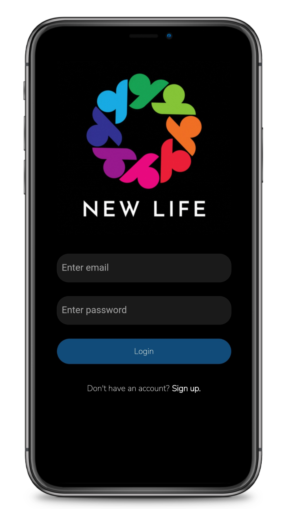
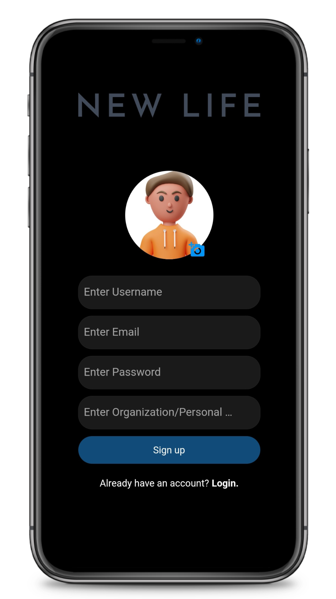
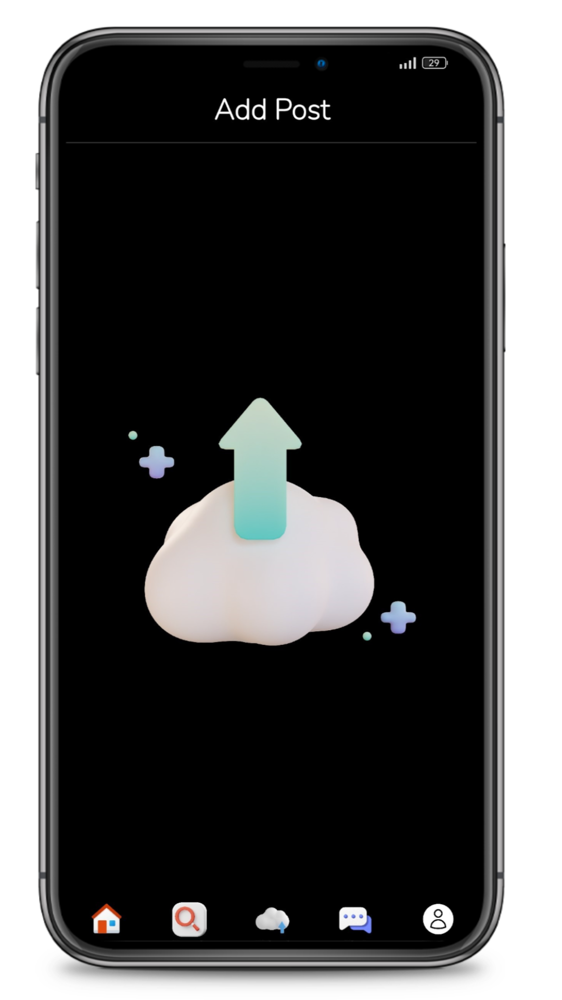
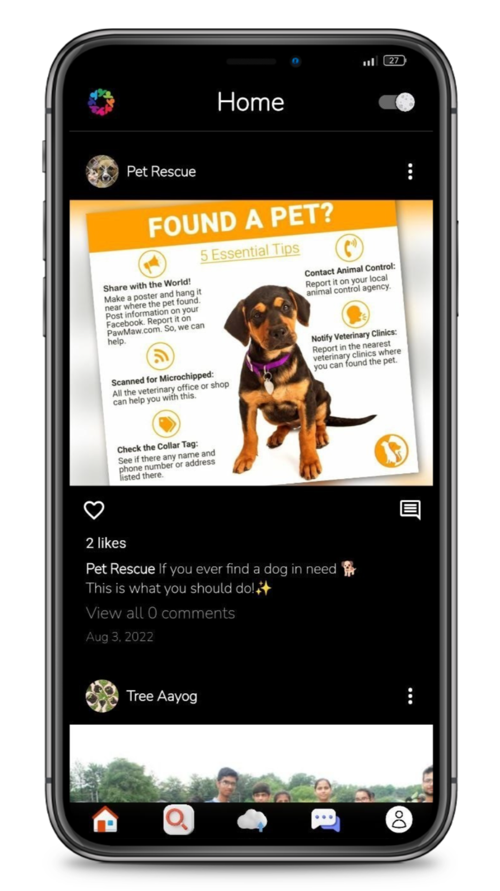
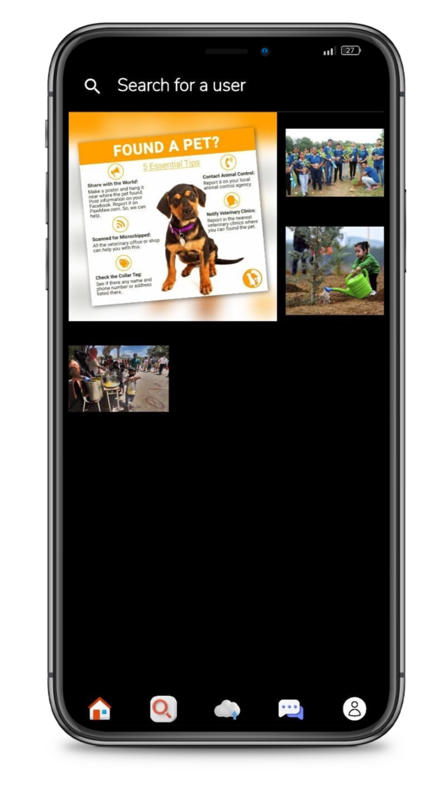
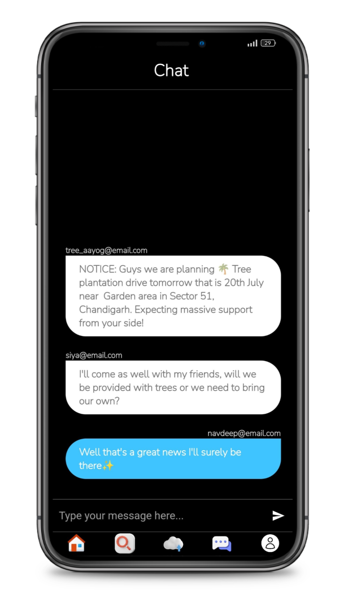
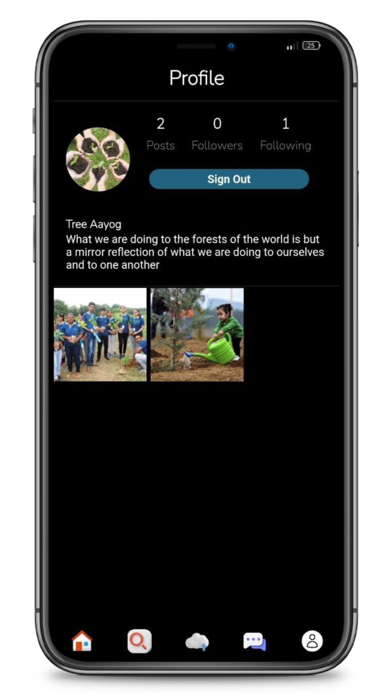
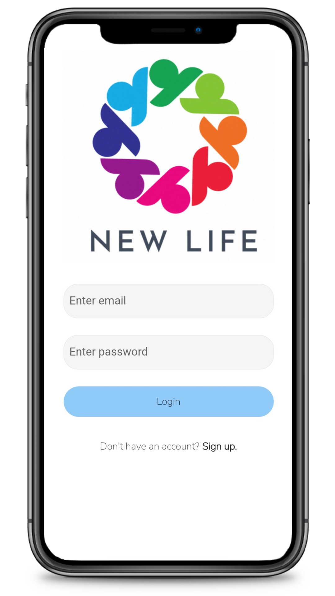
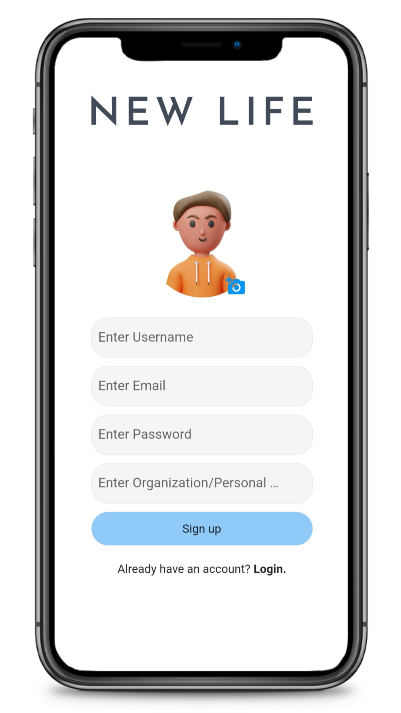
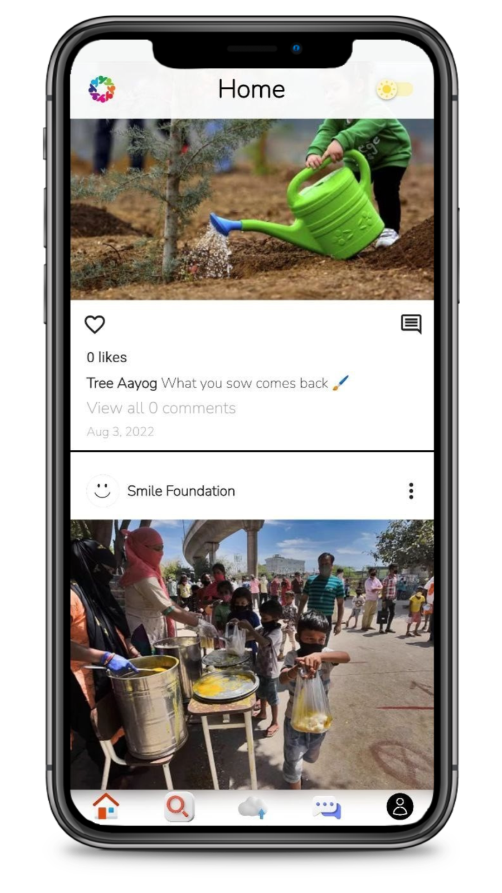

<p align="center"> 
  
</p>

<h1 align="center"> New Life </h1>

Web, Android and iOS Application
Technologies Used: Flutter, Dart and Firebase
Manages profiles for Orphanages, Old Age Homes, NGOs and Charities, Authentication and Authorization System, Community features to interact through posts, reactions, comments, and follow
relevant profiles, Instant Chatting provision for donations or for Notices.


<h2 id="credits"> :minidisc: Demo</h2>

- [Apk Link](https://drive.google.com/uc?export=download&id=1A4f3JbY_6fg9naVysMVv9sgZr8yQkFxF)
- [Live Web Link](https://navdeepsingh1609.github.io/new_life_web/#/)


<h2 id="credits"> :camera: App Snapshots</h2>
<h3>:waning_crescent_moon: Dark Mode:</h3>

&nbsp;
&nbsp;&nbsp;
&nbsp;&nbsp;

<h3>:sun_with_face: Light Mode:</h3>

&nbsp;


<h2 id="credits"> :clipboard: Execution Instructions</h2>
To run in emulator, open project in Android Studio, start the emulator and run the following:

```
flutter clean
flutter pub get
flutter run
```
To run in browser/chrome, open project in Android Studio run the following:

```
flutter clean
flutter pub get
flutter run -d chrome --web-renderer html
```

<h2 id="credits"> :scroll: Authors</h2>

- [@navdeepsingh1609](https://github.com/navdeepsingh1609)
- [@siyaadutta](https://github.com/siyaadutta)
